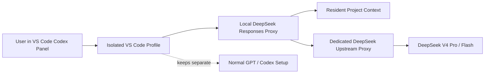
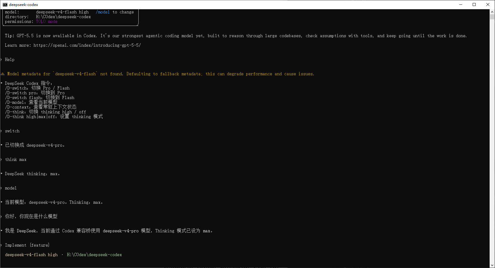
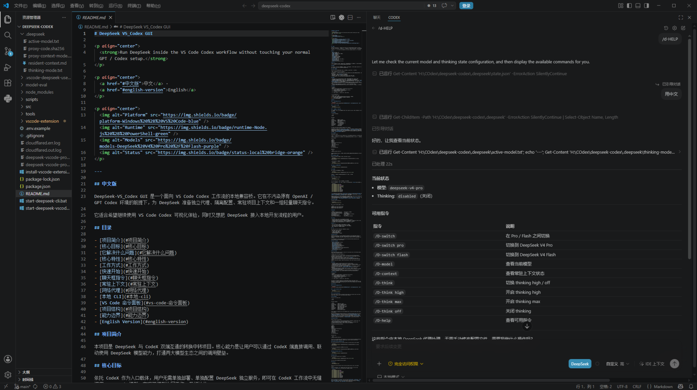

# DeepSeek Codex Bridge

<p align="center">
  <strong>Run DeepSeek inside the VS Code Codex workflow without touching your normal GPT / Codex setup.</strong>
</p>

<p align="center">
  <a href="#中文版">中文</a> ·
  <a href="#english-version">English</a>
</p>

<p align="center">
  
  
  
  
</p>

---

## 中文版

DeepSeek Codex Bridge 是一个面向 VS Code Codex 工作流的本地兼容桥。它通过本地 Responses 兼容代理，把 DeepSeek 接入 Codex 的桌面体验，同时使用隔离的 VS Code profile 和独立的 Codex 配置，避免污染你原本的 OpenAI / GPT Codex 环境。

它适合希望继续使用 Codex 可视化文件联动、拖拽交互、diff、跳转、引导式任务和插件 / MCP 配置能力，同时又想把部分任务路由给 DeepSeek V4 Pro / Flash 的用户。

## 目录

- [项目简介](#项目简介)
- [核心目标](#核心目标)
- [它解决什么问题](#它解决什么问题)
- [核心特性](#核心特性)
- [工作方式](#工作方式)
- [界面预览](#界面预览)
- [快速开始](#快速开始)
- [聊天框指令](#聊天框指令)
- [常驻上下文](#常驻上下文)
- [网络代理](#网络代理)
- [本地 CLI](#本地-cli)
- [VS Code 命令面板](#vs-code-命令面板)
- [最小故障排查](#最小故障排查)
- [项目结构](#项目结构)
- [能力边界](#能力边界)
- [适合谁使用](#适合谁使用)
- [贡献](#贡献)
- [许可证](#许可证)
- [English Version](#english-version)

## 项目简介

本项目是 DeepSeek 与 VS Code Codex 工作流之间的本地转换中转层。它不尝试替换 Codex，也不修改用户真实的 OpenAI / GPT Codex 环境，而是在隔离环境里提供一个 DeepSeek 兼容入口，让用户可以继续使用 Codex 桌面端的文件、对话、插件和可视化工作流。

## 核心目标

依托 Codex 作为入口载体，让用户无需反复切换工具、复制上下文或手动改配置，即可在同一套开发工作流中使用 DeepSeek V4 Pro / Flash。项目优先保证稳定隔离、命令清晰、上下文可复用和工具调用不中断，再逐步增强 thinking、长上下文和图形入口体验。

## 它解决什么问题

Codex 的 VS Code 桌面体验适合真实项目开发，但第三方模型接入通常会带来配置、上下文、网络和工具协议上的摩擦。

| 问题 | DeepSeek Codex Bridge 的处理方式 |
| --- | --- |
| 上下文传递不稳定 | 启动时生成常驻项目上下文，同时保留 Codex 聊天窗口、附件、选区和工具结果的最高优先级 |
| 模型切换麻烦 | 提供 `/D-switch`、`switch flash` 等统一命令别名 |
| DeepSeek 和 GPT 网络路径冲突 | DeepSeek 上游请求可单独指定 HTTP / HTTPS 代理 |
| 不想影响原 Codex 环境 | 使用隔离 VS Code profile、独立 `CODEX_HOME` 和独立配置 |
| CLI 交互不透明 | 保留 VS Code Codex 面板、文件窗口联动、diff、跳转和会话体验 |
| 工作过程不可见 | 注入可见工作流策略，让 DS 给出短进度更新，并在完成后总结文件与 diff |
| thinking 与工具调用冲突 | 代理缓存并回填 DeepSeek `reasoning_content`，缓存缺失时自动降级以避免断流 |

## 核心特性

- **隔离运行**：独立 VS Code profile 与独立 Codex 配置，不覆盖正常 GPT / Codex 环境。
- **DeepSeek 模型切换**：支持 DeepSeek V4 Pro / Flash，可通过聊天框或 CLI 命令切换。
- **统一命令解析**：`/D-switch flash`、`D switch flash`、`switch flash`、`switch-flash` 等等价写法走同一套逻辑。
- **thinking 模式控制**：支持 `think high` / `think max` / `think off`，并在工具调用回合中尽量保持 thinking。
- **reasoning_content 回填**：工具调用时缓存 DeepSeek 返回的 `reasoning_content`，下一轮工具结果回传时自动补回。
- **可见工作流输出**：默认要求 DS 在工作中给出短进度更新，完成后整理文件变更、行为变化、diff 摘要和验证结果。
- **常驻项目上下文**：默认生成 `.deepseek/resident-context.md`，作为低优先级项目背景材料。
- **独立网络代理**：DeepSeek 上游请求可单独走代理，不影响原本 OpenAI / GPT 请求路径。
- **VS Code Codex 工作流保留**：继续使用 Codex 面板、文件上下文、拖拽、选区、diff、跳转和引导功能。
- **本地 CLI 入口**：偏命令行使用时，可通过 BAT 封装启动同一套隔离环境。
- **Launcher Extension**：可安装本地 VS Code launcher extension，通过命令面板打开隔离窗口。

## 工作方式



启动脚本会完成以下准备：

1. 生成隔离 Codex 配置。
2. 同步主 Codex 配置中的插件、MCP、marketplace、connector 配置块。
3. 刷新常驻项目上下文。
4. 启动或按代码 hash 自动重启本地 DeepSeek 兼容代理。
5. 打开隔离 VS Code 窗口，或启动隔离 CLI。

## 界面预览

项目同时支持轻量 CLI 工作流与完整 VS Code Codex 图形工作流。

### CLI 界面

适合偏命令行的工作流。可以在本地桥接环境里查看当前模型、切换 DeepSeek V4 Pro / Flash、调整 thinking 模式，并验证 `help`、`model`、`switch flash` 等短指令是否由代理拦截。



### VS Code 图形界面

适合日常项目开发。保留 Codex 在 VS Code 中的对话、文件、跳转、工作区联动、拖拽和可视化操作体验，同时通过隔离配置接入 DeepSeek。



## 快速开始

### 1. 设置 DeepSeek API Key

```powershell
[Environment]::SetEnvironmentVariable("DEEPSEEK_API_KEY", "your-deepseek-api-key", "User")
```

### 2. 启动隔离 VS Code

```powershell
.\start-deepseek-vscode.bat
```

### 3. 在新窗口使用 Codex 面板

打开后的窗口使用隔离 profile。你可以像平时一样在 Codex 面板里发送任务、附加文件、查看 diff、拖拽文件、使用选区上下文或继续项目会话。

## 聊天框指令

在 Codex 聊天框输入：

```text
/D-help
```

可用指令：

```text
/D-switch          切换 Pro / Flash
/D-switch pro      切换到 DeepSeek V4 Pro
/D-switch flash    切换到 DeepSeek V4 Flash
/D-model           查看当前模型与 thinking 状态
/D-context         查看常驻上下文状态
/D-think           切换 thinking high / off
/D-think high      开启 thinking high
/D-think max       开启 thinking max
/D-think off       关闭 thinking
/D-help            查看可用指令
```

这些指令由本地 DeepSeek 代理处理，不需要手动修改配置文件。代理也支持等价短写：`help`、`model`、`switch flash`、`switch pro`、`think max`、`think high`、`think off`。

说明：Codex CLI 状态栏里的 reasoning effort 是 Codex 自己的显示项，不是 DeepSeek 的原生档位。DeepSeek V4 的 thinking 由 `thinking.enabled/disabled` 和 `reasoning_effort=high|max` 控制。工具工作流中，代理会缓存 DeepSeek 返回的 `reasoning_content` 并在工具结果回合自动回填；如果代理重启或缓存缺失，本次请求会自动降级为 `thinking disabled`，避免断流。

默认还会注入一条可见工作流策略：DS 工作时应输出简短进度说明，完成后总结改动文件、行为变化、diff 摘要和验证结果。它不是私有思维链输出；如果你想关闭，可设置 `DEEPSEEK_WORKFLOW_PROMPT=off`。

## 常驻上下文

常驻上下文默认开启。它不是一次性问答内容，而是为 DeepSeek Codex 的每轮请求提供低优先级项目背景。Codex 聊天窗口里的最新用户消息、附件、选区和工具结果始终优先。

默认扫描：

```text
README.md
AGENTS.md
CLAUDE.md
GEMINI.md
.github/copilot-instructions.md
.cursor/rules
.codex/rules
.codex/instructions.md
.codex/skills
**/SKILL.md
**/*.rules.md
**/*.instructions.md
```

生成文件：

```text
.deepseek/resident-context.md
```

该文件不会提交到仓库。

### 自定义扫描范围

```powershell
.\start-deepseek-vscode.bat -ResidentContextPath README.md,src,scripts
```

### 跳过自动刷新

```powershell
.\start-deepseek-vscode.bat -SkipResidentContext
```

## 网络代理

如果 DeepSeek 上游请求需要走独立代理：

```powershell
.\start-deepseek-vscode.bat -DeepSeekProxyUrl http://127.0.0.1:7890
```

该代理只用于 DeepSeek 上游请求，不影响正常 GPT / Codex 使用路径。脚本也会为本地 `127.0.0.1` / `localhost` 设置 `NO_PROXY`，避免 VPN 或系统代理把本地桥接流量错误转发出去。

## 本地 CLI

只想使用本地 Codex CLI 时：

```powershell
.\start-deepseek-cli.bat
```

CLI 与 VS Code 共用同一套隔离配置、代理和常驻上下文。

Codex CLI 会优先拦截 `/xxx` 命令，所以不要在 CLI 交互界面里输入 `/D-switch`。请在终端外部使用：

```powershell
.\start-deepseek-cli.bat help
.\start-deepseek-cli.bat switch
.\start-deepseek-cli.bat switch flash
.\start-deepseek-cli.bat switch pro
.\start-deepseek-cli.bat switch-flash
.\start-deepseek-cli.bat switch-pro
.\start-deepseek-cli.bat model
.\start-deepseek-cli.bat context
.\start-deepseek-cli.bat think
.\start-deepseek-cli.bat think max
.\start-deepseek-cli.bat think high
.\start-deepseek-cli.bat think off
```

在 CLI 交互会话里，也可以直接发送 `help`、`model`、`switch flash`、`switch pro`、`think max`、`think high` 或 `think off`；本地代理会把它们当成控制指令，不会转给模型生成普通回答。正在运行中的 Codex CLI 底部状态栏不会热刷新，所以它可能仍显示启动时的模型名。实际请求会由本地代理按最新状态文件路由；新开 CLI / VS Code 会读取更新后的隔离配置。

启动脚本会在代理代码变化时自动重启本地代理。如果已打开的 CLI 仍把 `help`、`switch flash` 等控制句当成普通问题，请运行：

```powershell
.\start-deepseek-vscode.bat -ProxyOnly -RestartProxy
```

## VS Code 命令面板

安装本地 launcher extension：

```powershell
.\install-vscode-extension.bat
```

重启 VS Code 后，可在命令面板中使用：

```text
DeepSeek Codex: Open Isolated Window
DeepSeek Codex: Open Isolated Flash
DeepSeek Codex: Open Isolated Pro
```

## 最小故障排查

### 1. 提示 `Model metadata ... not found`

这是 Codex 对非官方模型元数据的回退提示。通常不影响本地代理转发，但可能影响 Codex 对模型能力、推理强度或上下文长度的估计。

建议先确认：

```text
/D-model
/D-help
```

如果模型显示正常，可以继续使用；如果输出异常，再检查 `.deepseek/active-model.txt` 与启动脚本中的模型名是否一致。

### 2. `/D-switch` 或 `/D-help` 没有反应

先确认你正在使用隔离窗口，而不是普通 Codex 窗口。然后刷新代理：

```powershell
.\start-deepseek-vscode.bat -ProxyOnly -RestartProxy
```

仍然无效时，查看本地代理日志：

```text
deepseek-vscode-proxy.err.log
deepseek-vscode-proxy.out.log
```

### 3. 请求失败或连接 DeepSeek 超时

确认 API Key 已写入用户环境变量：

```powershell
[Environment]::GetEnvironmentVariable("DEEPSEEK_API_KEY", "User")
```

如果需要代理，使用独立 DeepSeek 代理参数启动：

```powershell
.\start-deepseek-vscode.bat -DeepSeekProxyUrl http://127.0.0.1:7890
```

### 4. 常驻上下文没有更新

删除旧文件后重新启动，或手动指定扫描范围：

```powershell
Remove-Item .deepseek/resident-context.md -ErrorAction SilentlyContinue
.\start-deepseek-vscode.bat -ResidentContextPath README.md,src,scripts
```

### 5. thinking 模式下工具调用断流

优先刷新代理，确保正在使用包含 `reasoning_content` 缓存回填逻辑的新版本：

```powershell
.\start-deepseek-vscode.bat -ProxyOnly -RestartProxy
```

如果代理在工具调用中丢失缓存，会自动把当前请求降级为 `thinking disabled`。如果仍不稳定，请临时执行：

```powershell
.\start-deepseek-cli.bat think off
```

## 项目结构

```text
src/deepseek-responses-proxy.mjs      本地 Responses 兼容代理
scripts/start-deepseek-vscode.ps1     主启动脚本
scripts/deepseek-long-context.ps1     常驻上下文生成器
scripts/deepseek-long-context.mjs     常驻上下文生成逻辑
vscode-extension/                     本地 VS Code launcher extension
start-deepseek-vscode.bat             VS Code 一键入口
start-deepseek-cli.bat                CLI 一键入口
install-vscode-extension.bat          安装本地 launcher extension
docs/images/                          README 截图资源
LICENSE                               MIT License
```

## 能力边界

- 这是兼容桥，不是 Codex 官方原生 DeepSeek provider。
- 原生工作流卡片、diff 卡片和工具事件显示由官方 Codex 扩展控制。
- 插件、MCP、marketplace、connector 配置可以同步，但最终可用性以 Codex 面板实际暴露为准。
- 常驻上下文是低优先级项目背景，不替代用户当前明确给出的文件、选区、附件和任务指令。
- 可见工作流输出依赖模型遵循提示；它不是 Codex 官方原生 reasoning 卡片，也不会展示私有链式推理。
- thinking 在工具调用中依赖代理内存缓存；代理重启后旧 tool call 的 `reasoning_content` 不再可恢复。
- 当前快速启动路径以 Windows、PowerShell 和 VS Code 工作流为主。

## 适合谁使用

- 想在 VS Code Codex 桌面体验中接入 DeepSeek 的开发者。
- 想让 GPT / Codex 与 DeepSeek 保持隔离、并行使用的用户。
- 希望复用项目背景上下文，而不是每轮重复粘贴 README、规则和约束的人。
- 需要为 DeepSeek 单独配置代理出口的人。
- 想保留文件窗口联动、拖拽交互、引导式任务和 Codex 插件 / MCP 配置能力的人。

## 贡献

欢迎提交 Issue 或 Pull Request。反馈问题时，建议附上：

- 操作系统与 PowerShell 版本。
- VS Code 与 Codex 扩展版本。
- 使用的启动脚本与参数。
- 本地代理日志或错误片段。
- 是否启用了 DeepSeek 独立代理。
- 是否开启了 `think high` / `think max`。

## 许可证

本项目使用 MIT License。发布仓库时请保留根目录下的 [LICENSE](./LICENSE) 文件。

## English Version

DeepSeek Codex Bridge is a local compatibility bridge for the VS Code Codex workflow. It routes selected Codex traffic to DeepSeek through a local Responses-compatible proxy while keeping your normal OpenAI / GPT Codex setup separate.

It is designed for users who want DeepSeek V4 Pro / Flash inside the VS Code Codex desktop experience, including visual file context, drag-and-drop interaction, diffs, navigation, guided workflows, and plugin / MCP config reuse.

## Table of Contents

- [Project Overview](#project-overview)
- [Core Goals](#core-goals)
- [What It Solves](#what-it-solves)
- [Features](#features)
- [How It Works](#how-it-works)
- [Screenshots](#screenshots)
- [Quick Start](#quick-start)
- [Chat Commands](#chat-commands)
- [Resident Context](#resident-context)
- [Network Proxy](#network-proxy)
- [Local CLI](#local-cli)
- [VS Code Command Palette](#vs-code-command-palette)
- [Minimal Troubleshooting](#minimal-troubleshooting)
- [Project Layout](#project-layout)
- [Limits](#limits)
- [Who This Is For](#who-this-is-for)
- [Contributing](#contributing)
- [License](#license)

## Project Overview

This project is a local bridge between DeepSeek and the VS Code Codex workflow. It does not replace Codex or rewrite the user's real OpenAI / GPT Codex setup. Instead, it creates an isolated DeepSeek-compatible entrypoint so users can keep the Codex desktop experience for files, chat, plugins, and visual project work.

## Core Goals

The goal is to use Codex as the workflow shell while routing selected work through DeepSeek V4 Pro / Flash without repeated context copying or manual config edits. The project prioritizes stable isolation, clear commands, reusable context, and uninterrupted tool-call workflows before expanding thinking mode, long-context use cases, and GUI entrypoints.

## What It Solves

The VS Code Codex desktop workflow is useful for real project work, but third-party model bridges often introduce friction around configuration, context, proxy routing, and tool-call protocol details.

| Problem | How this project handles it |
| --- | --- |
| Context may not reach the model reliably | Generates resident project context while keeping chat-window context, attachments, selections, and tool results authoritative |
| Model switching is slow | Adds `/D-switch`, `switch flash`, and other unified command aliases |
| DeepSeek and GPT need different network paths | Allows a dedicated HTTP / HTTPS upstream proxy for DeepSeek |
| Normal Codex setup should stay untouched | Uses an isolated VS Code profile, isolated `CODEX_HOME`, and separate config |
| CLI-only usage feels opaque | Keeps the Codex panel, file linkage, diffs, jumps, and session flow |
| Work progress is hard to observe | Injects a visible workflow policy so DS gives short progress updates and final diff summaries |
| thinking can conflict with tool calls | Caches and replays DeepSeek `reasoning_content`; downgrades safely when cache is missing |

## Features

- **Isolated runtime**: separate VS Code profile and Codex config, leaving your normal GPT / Codex setup untouched.
- **DeepSeek model switching**: DeepSeek V4 Pro / Flash with chat and CLI commands.
- **Unified command parser**: equivalent forms such as `/D-switch flash`, `D switch flash`, `switch flash`, and `switch-flash` share one parser.
- **thinking mode control**: supports `think high`, `think max`, and `think off`.
- **reasoning_content replay**: caches DeepSeek `reasoning_content` from tool-call turns and passes it back with tool outputs.
- **Visible workflow output**: asks DS to provide short progress updates while working and final summaries with changed files, behavior changes, diff summary, and verification.
- **Resident project context**: generates `.deepseek/resident-context.md` as low-priority project background.
- **Dedicated upstream proxy**: DeepSeek traffic can use a separate proxy path.
- **VS Code Codex workflow**: keep chat, files, selections, drag-and-drop, diffs, navigation, and guided task interaction.
- **Local CLI entrypoint**: use the same isolated environment from the command line.
- **Launcher extension**: open isolated windows from the VS Code command palette.

## How It Works


On startup, the launcher:

1. Creates the isolated Codex config.
2. Syncs plugin / MCP / marketplace / connector config blocks from the main Codex config.
3. Refreshes resident project context.
4. Starts or hash-refreshes the local DeepSeek compatibility proxy.
5. Opens an isolated VS Code window or starts the isolated CLI.

## Screenshots

The project supports both a lightweight CLI workflow and a full VS Code Codex GUI workflow.

### CLI UI

For users who prefer a command-line workflow. The local bridge can show the active model, switch between DeepSeek V4 Pro / Flash, adjust thinking mode, and verify short commands such as `help`, `model`, and `switch flash`.


### VS Code GUI

For day-to-day project development. It keeps the Codex chat panel, files, navigation, drag-and-drop interaction, workspace context, and visual workflow while routing selected work through the isolated DeepSeek bridge.


## Quick Start

### 1. Set the DeepSeek API key

```powershell
[Environment]::SetEnvironmentVariable("DEEPSEEK_API_KEY", "your-deepseek-api-key", "User")
```

### 2. Launch isolated VS Code

```powershell
.\start-deepseek-vscode.bat
```

### 3. Use the Codex panel

Use the Codex panel in the new isolated VS Code window as you normally would: send tasks, attach files, inspect diffs, drag files into context, use selections, and continue project sessions.

## Chat Commands

Type this in the Codex chat:

```text
/D-help
```

Available commands:

```text
/D-switch          Toggle Pro / Flash
/D-switch pro      Switch to DeepSeek V4 Pro
/D-switch flash    Switch to DeepSeek V4 Flash
/D-model           Show the active model and thinking state
/D-context         Show resident context status
/D-think           Toggle thinking high / off
/D-think high      Enable thinking high
/D-think max       Enable thinking max
/D-think off       Disable thinking
/D-help            Show available commands
```

These commands are handled by the local DeepSeek proxy, so you do not need to edit config files manually. The proxy also accepts short aliases such as `help`, `model`, `switch flash`, `switch pro`, `think max`, `think high`, and `think off`.

Note: the reasoning effort shown by Codex CLI is a Codex-side display field, not a native DeepSeek tier. DeepSeek V4 thinking is controlled by `thinking.enabled/disabled` and `reasoning_effort=high|max`. In tool workflows, the proxy caches DeepSeek `reasoning_content` and passes it back with tool results; if the proxy restarts or the cache is missing, that request is automatically downgraded to `thinking disabled` to avoid stream failures.

The proxy also injects a visible workflow policy by default: DS should provide short progress updates while working and finish with changed files, behavior changes, diff summary, and verification. This is not hidden chain-of-thought output. Set `DEEPSEEK_WORKFLOW_PROMPT=off` to disable it.

## Resident Context

Resident context is enabled by default. It is not a one-off prompt; it provides low-priority project background to every DeepSeek Codex request. Latest chat messages, attachments, selected code, and tool results always take priority.

Default discovery:

```text
README.md
AGENTS.md
CLAUDE.md
GEMINI.md
.github/copilot-instructions.md
.cursor/rules
.codex/rules
.codex/instructions.md
.codex/skills
**/SKILL.md
**/*.rules.md
**/*.instructions.md
```

Generated file:

```text
.deepseek/resident-context.md
```

This file is not committed to the repository.

### Customize the scope

```powershell
.\start-deepseek-vscode.bat -ResidentContextPath README.md,src,scripts
```

### Skip refresh

```powershell
.\start-deepseek-vscode.bat -SkipResidentContext
```

## Network Proxy

Use a dedicated upstream proxy for DeepSeek:

```powershell
.\start-deepseek-vscode.bat -DeepSeekProxyUrl http://127.0.0.1:7890
```

This only affects DeepSeek upstream requests. The launcher also keeps local `127.0.0.1` / `localhost` traffic out of system proxy routing so VPN settings do not break the local bridge.

## Local CLI

```powershell
.\start-deepseek-cli.bat
```

The CLI and VS Code entrypoints share the same isolated config, proxy, and resident context.

Codex CLI intercepts `/xxx` commands before they reach the proxy, so do not type `/D-switch` inside the CLI. Use terminal-level commands instead:

```powershell
.\start-deepseek-cli.bat help
.\start-deepseek-cli.bat switch
.\start-deepseek-cli.bat switch flash
.\start-deepseek-cli.bat switch pro
.\start-deepseek-cli.bat switch-flash
.\start-deepseek-cli.bat switch-pro
.\start-deepseek-cli.bat model
.\start-deepseek-cli.bat context
.\start-deepseek-cli.bat think
.\start-deepseek-cli.bat think max
.\start-deepseek-cli.bat think high
.\start-deepseek-cli.bat think off
```

Inside an interactive CLI session, you can also send `help`, `model`, `switch flash`, `switch pro`, `think max`, `think high`, or `think off`; the local proxy treats them as control commands instead of forwarding them as normal model prompts. The status line of an already-running Codex CLI session does not hot-refresh, so it may still show the model used at startup. Actual requests are routed by the local proxy using the latest state file; new CLI / VS Code sessions read the updated isolated config.

The startup script automatically restarts the local proxy when proxy code changes. If an already-open CLI still treats `help` or `switch flash` as a normal prompt, run:

```powershell
.\start-deepseek-vscode.bat -ProxyOnly -RestartProxy
```

## VS Code Command Palette

Install the local launcher extension:

```powershell
.\install-vscode-extension.bat
```

After restarting VS Code, use:

```text
DeepSeek Codex: Open Isolated Window
DeepSeek Codex: Open Isolated Flash
DeepSeek Codex: Open Isolated Pro
```

## Minimal Troubleshooting

### 1. `Model metadata ... not found`

This is Codex falling back when it cannot find metadata for a non-official model name. The local bridge may still work, but Codex may estimate model capability, reasoning mode, or context length less accurately.

First check:

```text
/D-model
/D-help
```

If the active model is correct, you can continue. If the output is inconsistent, check whether `.deepseek/active-model.txt` matches the model names used by the startup scripts.

### 2. `/D-switch` or `/D-help` does nothing

Make sure you are using the isolated VS Code window, not the normal Codex window. Then refresh the proxy:

```powershell
.\start-deepseek-vscode.bat -ProxyOnly -RestartProxy
```

If it still fails, check the local proxy logs:

```text
deepseek-vscode-proxy.err.log
deepseek-vscode-proxy.out.log
```

### 3. Requests fail or DeepSeek times out

Confirm that the API key exists in the user environment variables:

```powershell
[Environment]::GetEnvironmentVariable("DEEPSEEK_API_KEY", "User")
```

If DeepSeek needs a proxy, launch with a dedicated upstream proxy:

```powershell
.\start-deepseek-vscode.bat -DeepSeekProxyUrl http://127.0.0.1:7890
```

### 4. Resident context is stale

Remove the generated file and restart, or specify the scan scope manually:

```powershell
Remove-Item .deepseek/resident-context.md -ErrorAction SilentlyContinue
.\start-deepseek-vscode.bat -ResidentContextPath README.md,src,scripts
```

### 5. Tool calls fail in thinking mode

Refresh the proxy first to make sure the `reasoning_content` replay logic is running:

```powershell
.\start-deepseek-vscode.bat -ProxyOnly -RestartProxy
```

If the proxy loses cache for a tool call, it automatically downgrades that request to `thinking disabled`. If the workflow is still unstable, temporarily run:

```powershell
.\start-deepseek-cli.bat think off
```

## Project Layout

```text
src/deepseek-responses-proxy.mjs      Local Responses-compatible proxy
scripts/start-deepseek-vscode.ps1     Main startup script
scripts/deepseek-long-context.ps1     Resident context builder
scripts/deepseek-long-context.mjs     Resident context implementation
vscode-extension/                     Local VS Code launcher extension
start-deepseek-vscode.bat             VS Code entrypoint
start-deepseek-cli.bat                CLI entrypoint
install-vscode-extension.bat          Launcher extension installer
docs/images/                          README screenshots
LICENSE                               MIT License
```

## Limits

- This is a compatibility bridge, not a native Codex DeepSeek provider.
- Native workflow cards, diff cards, and tool event rendering are controlled by the official Codex extension.
- Plugin, MCP, marketplace, and connector config blocks can be synced, but final availability depends on what the Codex panel exposes.
- Resident context is project background; explicit user instructions, attached files, and selections still take priority.
- Visible workflow output depends on model instruction-following; it is not a native Codex reasoning card and does not expose hidden chain-of-thought.
- thinking in tool workflows depends on proxy memory cache; after a proxy restart, old tool-call `reasoning_content` cannot be recovered.
- The current quick-start path is centered on Windows, PowerShell, and VS Code.

## Who This Is For

- Developers who want to use DeepSeek inside the VS Code Codex desktop workflow.
- Users who want DeepSeek and normal GPT / Codex environments to stay isolated.
- Projects that benefit from reusable resident context instead of repeated prompt setup.
- Users who need a dedicated proxy path for DeepSeek traffic.
- Users who want file-window linkage, drag-and-drop context, guided workflows, and Codex plugin / MCP config reuse.

## Contributing

Issues and pull requests are welcome. When reporting a problem, please include:

- Operating system and PowerShell version.
- VS Code and Codex extension versions.
- Startup script and parameters used.
- Relevant local proxy logs or error snippets.
- Whether a dedicated DeepSeek proxy was enabled.
- Whether `think high` / `think max` was enabled.

## License

This project uses the MIT License. Keep the root [LICENSE](./LICENSE) file in the repository.
