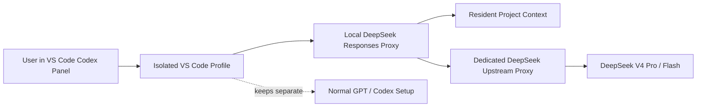

# DeepSeek VS_Codex GUI

<p align="center">
  <strong>Run DeepSeek inside the VS Code Codex workflow without touching your normal GPT / Codex setup.</strong>
</p>

<p align="center">
  <a href="#中文版">中文</a> ·
  <a href="#english-version">English</a>
</p>

<p align="center">
  
  
  
  
</p>

---

## 中文版

DeepSeek-VS_Codex GUI 是一个面向 VS Code Codex 工作流的本地兼容桥。它在不污染原有 OpenAI / GPT Codex 环境的前提下，为 DeepSeek 准备独立代理、隔离配置、常驻项目上下文和一组轻量聊天指令。

它适合希望继续使用 VS Code Codex 可视化体验，同时又想把 DeepSeek 接入本地开发流程的用户。

## 目录

- [项目简介](#项目简介)
- [核心目标](#核心目标)
- [它解决什么问题](#它解决什么问题)
- [核心特性](#核心特性)
- [工作方式](#工作方式)
- [快速开始](#快速开始)
- [聊天框指令](#聊天框指令)
- [常驻上下文](#常驻上下文)
- [网络代理](#网络代理)
- [本地 CLI](#本地-cli)
- [VS Code 命令面板](#vs-code-命令面板)
- [项目结构](#项目结构)
- [能力边界](#能力边界)
- [English Version](#english-version)

## 项目简介

本项目是 DeepSeek 与 CodeX 双端互通的转换中转项目。核心能力是让用户可以通过 CodeX 端直接调用、联动使用 DeepSeek 模型能力，打通两大模型生态之间的调用壁垒。

## 核心目标

依托 CodeX 作为入口载体，用户无需单独部署、单独配置 DeepSeek 独立服务，即可在 CodeX 工作流中无缝调用 DeepSeek 模型，实现双模型协同工作、互相补位。

## 它解决什么问题

Codex 的 VS Code 桌面体验适合真实项目开发，但接入第三方模型时常见几个摩擦点：

| 问题 | DeepSeek-VS_Codex GUI 的处理方式 |
| --- | --- |
| 上下文不稳定 | 启动时生成常驻项目上下文，并在请求时自动注入 |
| 模型切换麻烦 | 提供 `/D-switch` 等聊天框短指令 |
| 代理路径混杂 | DeepSeek 上游请求走独立代理配置 |
| 不想影响原 Codex 环境 | 使用隔离 VS Code profile 和隔离 Codex 配置 |
| CLI 调用偏黑盒 | 保留 VS Code Codex 面板、文件、diff、跳转和会话体验 |

## 核心特性

- **隔离运行**：独立 VS Code profile 与 Codex 配置，不污染正常 GPT / Codex 环境。
- **DeepSeek 模型切换**：支持 DeepSeek V4 Pro / Flash，并可通过聊天框指令切换。
- **常驻项目上下文**：启动时扫描项目文件，生成 `.deepseek/resident-context.md`，为每轮请求提供项目背景。
- **独立网络代理**：DeepSeek 上游请求可单独配置代理，不影响原有 OpenAI / GPT 请求路径。
- **VS Code Codex 工作流保留**：继续使用 Codex 面板、文件上下文、选区、diff、跳转和任务交互体验。
- **本地 CLI 入口**：需要命令行模式时，可通过独立脚本启动本地 Codex CLI。
- **Launcher Extension**：可安装本地 VS Code launcher extension，通过命令面板打开隔离窗口。

## 工作方式



启动脚本会完成以下准备：

1. 生成隔离 Codex 配置。
2. 同步主 Codex 配置中的插件、MCP、marketplace、connector 配置块。
3. 刷新常驻项目上下文。
4. 启动本地 DeepSeek 兼容代理。
5. 打开隔离 VS Code 窗口。

## 快速开始

### 1. 设置 DeepSeek API Key

```powershell
[Environment]::SetEnvironmentVariable("DEEPSEEK_API_KEY", "your-deepseek-api-key", "User")
```

### 2. 启动隔离 VS Code

```powershell
.\start-deepseek-vscode.bat
```

### 3. 在新窗口使用 Codex 面板

打开后的窗口使用隔离 profile。你可以像平时一样在 Codex 面板里发送任务、附加文件、查看 diff 或继续项目会话。

## 聊天框指令

在 Codex 聊天框输入：

```text
/D-help
```

可用指令：

```text
/D-switch          切换 Pro / Flash
/D-switch pro      切换到 DeepSeek V4 Pro
/D-switch flash    切换到 DeepSeek V4 Flash
/D-model           查看当前模型
/D-context         查看常驻上下文状态
/D-help            查看可用指令
```

这些指令由本地 DeepSeek 代理处理，不需要手动修改配置文件。

## 常驻上下文

常驻上下文默认开启。它不是一次性问答内容，而是为 DeepSeek Codex 的每轮请求提供项目背景。

默认扫描：

```text
README.md
src
scripts
vscode-extension
```

生成文件：

```text
.deepseek/resident-context.md
```

该文件不会提交到仓库。

### 自定义扫描范围

```powershell
.\start-deepseek-vscode.bat -ResidentContextPath README.md,src,scripts
```

### 跳过自动刷新

```powershell
.\start-deepseek-vscode.bat -SkipResidentContext
```

## 网络代理

如果 DeepSeek 上游请求需要走独立代理：

```powershell
.\start-deepseek-vscode.bat -DeepSeekProxyUrl http://127.0.0.1:7890
```

该代理只用于 DeepSeek 上游请求，不影响正常 GPT / Codex 使用路径。

## 本地 CLI

只想使用本地 Codex CLI 时：

```powershell
.\start-deepseek-cli.bat
```

CLI 与 VS Code 共用同一套隔离配置、代理和常驻上下文。

## VS Code 命令面板

安装本地 launcher extension：

```powershell
.\install-vscode-extension.bat
```

重启 VS Code 后，可在命令面板中使用：

```text
DeepSeek Codex: Open Isolated Window
DeepSeek Codex: Open Isolated Flash
DeepSeek Codex: Open Isolated Pro
```

## 项目结构

```text
src/deepseek-responses-proxy.mjs      本地 Responses 兼容代理
scripts/start-deepseek-vscode.ps1     主启动脚本
scripts/deepseek-long-context.ps1     常驻上下文生成器
vscode-extension/                     本地 VS Code launcher extension
start-deepseek-vscode.bat             VS Code 一键入口
start-deepseek-cli.bat                CLI 一键入口
install-vscode-extension.bat          安装本地 launcher extension
```

## 能力边界

- 这是兼容桥，不是 Codex 官方原生 DeepSeek provider。
- 原生工作流卡片、diff 卡片和工具事件显示由官方 Codex 扩展控制。
- 插件、MCP、marketplace、connector 配置可以同步，但最终可用性以 Codex 面板实际显示为准。
- 常驻上下文是项目背景，不替代用户当前明确给出的文件、选区和任务指令。
- 当前快速启动路径以 Windows、PowerShell 和 VS Code 工作流为主。

## 适合谁使用

- 想在 VS Code Codex 桌面体验中接入 DeepSeek 的开发者。
- 想让 GPT / Codex 与 DeepSeek 保持隔离、并行使用的用户。
- 希望为项目准备稳定常驻上下文，而不是每轮重复粘贴背景的人。
- 需要为 DeepSeek 单独配置代理出口的人。

## 贡献

欢迎提交 Issue 或 Pull Request。反馈问题时，建议附上：

- 操作系统与 PowerShell 版本。
- VS Code 与 Codex 扩展版本。
- 使用的启动脚本与参数。
- 本地代理日志或错误片段。
- 是否启用了 DeepSeek 独立代理。

## English Version

DeepSeek-VS_Codex GUI is a local compatibility bridge for the VS Code Codex workflow. It keeps your normal OpenAI / GPT Codex setup separate while giving DeepSeek an isolated local proxy, a dedicated config path, resident project context, and a few lightweight chat commands.

It is designed for users who want to keep the VS Code Codex desktop experience while routing selected work through DeepSeek.

## Table of Contents

- [What It Solves](#what-it-solves)
- [Features](#features)
- [How It Works](#how-it-works)
- [Quick Start](#quick-start)
- [Chat Commands](#chat-commands)
- [Resident Context](#resident-context)
- [Network Proxy](#network-proxy)
- [Local CLI](#local-cli)
- [VS Code Command Palette](#vs-code-command-palette)
- [Project Layout](#project-layout)
- [Limits](#limits)
- [Contributing](#contributing)

## What It Solves

The VS Code Codex desktop workflow is useful for real project work, but third-party model bridges often introduce friction:

| Problem | How this project handles it |
| --- | --- |
| Context may not reach the model reliably | Generates resident project context and injects it into requests |
| Model switching is slow | Adds chat commands such as `/D-switch` |
| Network routing should be separate | Allows a dedicated DeepSeek upstream proxy |
| Normal Codex setup should stay untouched | Uses an isolated VS Code profile and Codex config |
| CLI-only usage feels opaque | Keeps the Codex panel, files, diffs, jumps, and session flow |

## Features

- **Isolated runtime**: separate VS Code profile and Codex config.
- **DeepSeek model switching**: DeepSeek V4 Pro / Flash with chat-based commands.
- **Resident project context**: generates `.deepseek/resident-context.md` on startup and uses it as project background.
- **Dedicated upstream proxy**: DeepSeek traffic can use a separate proxy path.
- **VS Code Codex workflow**: keep chat, files, selections, diffs, navigation, and guided task interaction in one workspace.
- **Local CLI entrypoint**: use the same isolated environment from the command line.
- **Launcher extension**: open isolated windows from the VS Code command palette.

## How It Works


On startup, the launcher prepares the isolated Codex config, syncs plugin / MCP / marketplace / connector config blocks, refreshes resident context, starts the local DeepSeek proxy, and opens an isolated VS Code window.

## Quick Start

### 1. Set the DeepSeek API key

```powershell
[Environment]::SetEnvironmentVariable("DEEPSEEK_API_KEY", "your-deepseek-api-key", "User")
```

### 2. Launch isolated VS Code

```powershell
.\start-deepseek-vscode.bat
```

### 3. Use the Codex panel

Use the Codex panel in the new isolated VS Code window as you normally would: send tasks, attach files, inspect diffs, and continue project sessions.

## Chat Commands

Type this in the Codex chat:

```text
/D-help
```

Available commands:

```text
/D-switch          Toggle Pro / Flash
/D-switch pro      Switch to DeepSeek V4 Pro
/D-switch flash    Switch to DeepSeek V4 Flash
/D-model           Show the active model
/D-context         Show resident context status
/D-help            Show available commands
```

These commands are handled by the local DeepSeek proxy, so you do not need to edit config files manually.

## Resident Context

Resident context is enabled by default. It is not a one-off prompt. It provides project background to every DeepSeek Codex request.

Default inputs:

```text
README.md
src
scripts
vscode-extension
```

Generated file:

```text
.deepseek/resident-context.md
```

This file is not committed to the repository.

### Customize the scope

```powershell
.\start-deepseek-vscode.bat -ResidentContextPath README.md,src,scripts
```

### Skip refresh

```powershell
.\start-deepseek-vscode.bat -SkipResidentContext
```

## Network Proxy

Use a dedicated upstream proxy for DeepSeek:

```powershell
.\start-deepseek-vscode.bat -DeepSeekProxyUrl http://127.0.0.1:7890
```

This only affects DeepSeek upstream requests.

## Local CLI

```powershell
.\start-deepseek-cli.bat
```

The CLI and VS Code entrypoints share the same isolated config, proxy, and resident context.

## VS Code Command Palette

Install the local launcher extension:

```powershell
.\install-vscode-extension.bat
```

After restarting VS Code, use:

```text
DeepSeek Codex: Open Isolated Window
DeepSeek Codex: Open Isolated Flash
DeepSeek Codex: Open Isolated Pro
```

## Project Layout

```text
src/deepseek-responses-proxy.mjs      Local Responses-compatible proxy
scripts/start-deepseek-vscode.ps1     Main startup script
scripts/deepseek-long-context.ps1     Resident context builder
vscode-extension/                     Local VS Code launcher extension
start-deepseek-vscode.bat             VS Code entrypoint
start-deepseek-cli.bat                CLI entrypoint
install-vscode-extension.bat          Launcher extension installer
```

## Limits

- This is a compatibility bridge, not a native Codex DeepSeek provider.
- Native workflow cards, diff cards, and tool event rendering are controlled by the official Codex extension.
- Plugin, MCP, marketplace, and connector config blocks can be synced, but final availability depends on what the Codex panel exposes.
- Resident context is project background; explicit user instructions, attached files, and selections still take priority.
- The current quick-start path is centered on Windows, PowerShell, and VS Code.

## Who This Is For

- Developers who want to use DeepSeek inside the VS Code Codex desktop workflow.
- Users who want DeepSeek and normal GPT / Codex environments to stay isolated.
- Projects that benefit from reusable resident context instead of repeated prompt setup.
- Users who need a dedicated proxy path for DeepSeek traffic.

## Contributing

Issues and pull requests are welcome. When reporting a problem, please include:

- Operating system and PowerShell version.
- VS Code and Codex extension versions.
- Startup script and parameters used.
- Relevant local proxy logs or error snippets.
- Whether a dedicated DeepSeek proxy was enabled.
